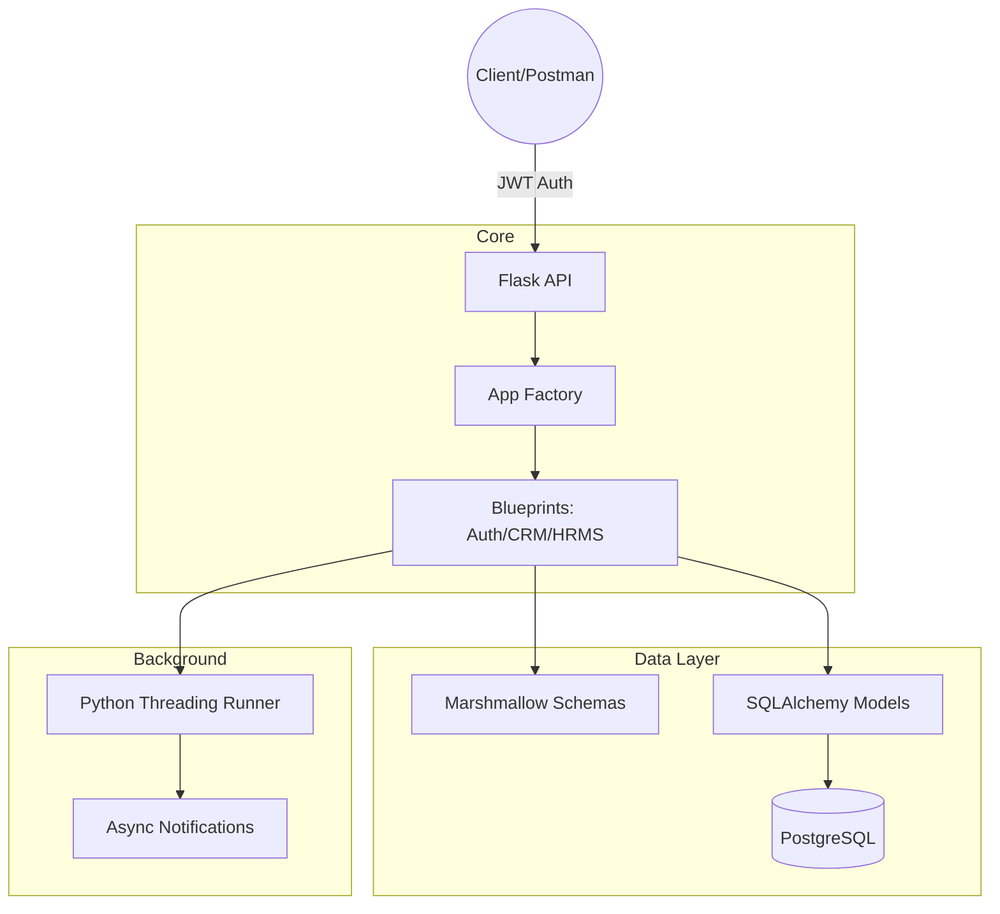

# HireHub: Integrated CRM & HRMS Backend

This is a production-hardened Flask backend that bridges Customer Relationship Management (CRM) and Human Resource Management (HRMS) into a unified, secure ecosystem.

## **HireHub: Technical Architecture & Design Report**

### **1. System Design and Architecture Decisions**
*   **Application Factory Pattern**: We used the `create_app()` factory pattern for scalability and environment isolation.
*   **Modular Blueprints**: Logic is separated into Blueprints (`auth`, `hrms`, `crm`, `performance`) to ensure maintainability and team-parallel development.
*   **Production WSGI**: The system is configured to run via **Gunicorn** in Docker, utilizing multiple workers and threads for concurrent request handling.



### **2. Data Modeling and Relationships**
*   **Normalization**: Relational structure ensures data integrity across HR and Sales.
*   **Integrity**: Strict use of UUIDs for users to prevent ID enumeration and PgEnum for restricted status fields.
*   **Business Constraints**: Automated checks ensure Leads can only be assigned to Employees with the `is_sales_agent` flag.

### **3. Security & Access Control**
*   **Granular RBAC**: A custom Scope + Permission system (e.g., `leave:can_write`) enforces strict access control.
*   **Data Scoping**: Sales agents are restricted to viewing only their assigned leads, while Admin/HR maintain global visibility.
*   **Secure Registration**: Public registration is restricted to the 'Sales' role by default. Administrative roles can only be assigned by existing Admins.
*   **Hardened Auth**: JWT tokens are signed using environment-only secrets (no unsafe fallbacks) and passwords use Bcrypt hashing.

### **4. Performance & Scalability**
*   **Materialized Scores**: Employee performance scores are calculated and cached in a dedicated table to ensure instant dashboard reads.
*   **Pagination**: List endpoints (e.g., Leads) support `page` and `per_page` parameters to handle large datasets efficiently.
*   **Async Processing**: Time-consuming tasks like notifications are handled by a background threading runner to ensure non-blocking API responses.

### **5. Key Decisions & Trade-offs**
*   **Threading vs. Celery**: We used native Python threading for background jobs. While Celery is more robust for extreme scales, threading keeps the project "plug-and-play" for reviewers while still achieving the async objective.
*   **Gunicorn Workers**: Configured 4 workers and 2 threads per worker in Docker to handle production-level traffic volume.

### **6. Testing Approach**
*   **Integration Testing**: Our Pytest suite verifies the full lifecycle (e.g., proving that a lead conversion correctly updates an agent's performance record).
*   **Database Isolation**: Tests run against a dedicated `hirehub_test_db` to ensure environment safety.

---

### **Quick Setup**

#### **Option A: Docker (Recommended)**
```bash
# This starts PostgreSQL and the Gunicorn-powered Flask App
docker-compose up --build
```
*The API will be available at `http://localhost:5000`.*

#### **Option B: Manual**
1. `pip install -r requirements.txt`
2. `flask db upgrade` (Initializes the database schema)
3. `python3 seed.py` (Seeds RBAC roles and permissions)
4. `flask run`

---

### **API Documentation**
Import `HireHub_API_Collection.json` into Postman. It includes pre-configured environment variables and example request bodies for all 26 endpoints.
